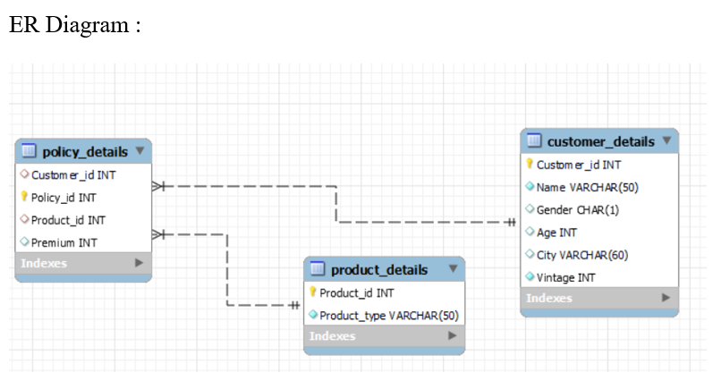
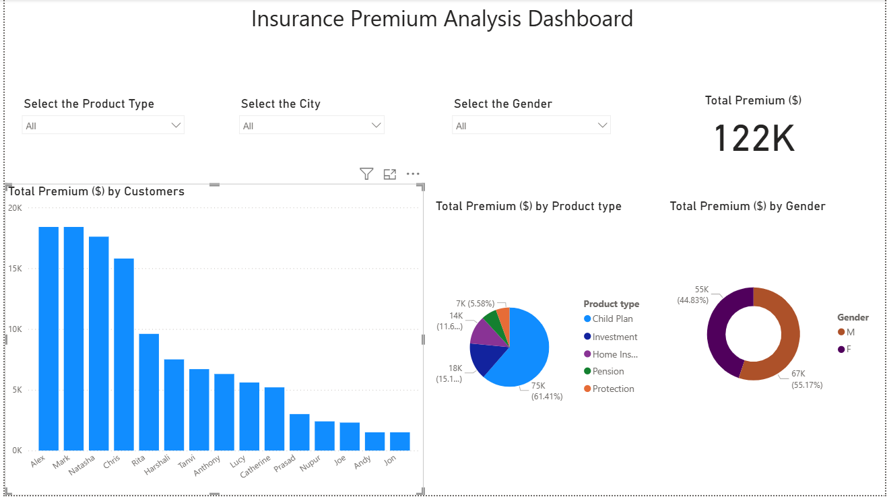

# 🏦 Insurance-Data-Analysis-System (SQL + Power BI Project)

---

## 📌 Project Overview

The **Insurance Management System** is a SQL and Power BI-based project designed to manage customers, insurance products, policies, and premium payments.  
It provides an efficient way to analyze data, generate insights, and streamline insurance policy management.

---

## ❓ Problem Statement
Insurance companies often struggle with handling vast amounts of customer and policy data efficiently.  
Manual processes lead to data redundancy, inconsistent records, and delays in premium tracking.  
This project solves these challenges by building a **centralized SQL database** that automates policy management, premium calculations, and customer record maintenance — ensuring accuracy, reliability, and analytical insight.


### This project demonstrates:
- 🧩 Database design and normalization  
- 🧮 SQL queries, joins, and stored procedures  
- ⚙️ Views, triggers, and constraints  
- 📊 Power BI dashboards for analytical insights  

---

## ✨ Features

- 👤 **Customer Management** – Store customer details with unique identifiers  
- 📑 **Policy Management** – Track insurance policies and linked products  
- 💰 **Premium Tracking** – Analyze premium amounts, due dates, and payments  
- 📊 **Data Analysis** – Insights on top products, customer contributions, gender split, and premium collections  
- 🗄️ **Relational Schema** – Proper use of primary keys, foreign keys, and constraints  
---

## 🗂️ Database Schema

### 🧱 Entities & Relationships
- **Customer** → Stores customer details  
- **Product** → Insurance products (Child Plan, Investment, Pension, etc.)  
- **Policy** → Policies linked to customers and products  

---
## 🧰 Tools Used
| Category | Tools |
|-----------|--------|
| Database | MySQL |
| Querying | SQL |
| Visualization | Power BI / Excel |
| Documentation | Markdown / Word |

---

## 📌 ER Diagram

Here is the ER Diagram of the Insurance Management System:



---

## 📌 Table Structure

#### 🧾 Customer_details


#### 🧾 Policy_details


#### 🧾 Product_details


---

## 🛠️ SQL Scripts

| Purpose | File Name |
|----------|------------|
| Database Schema | `create.sql` |
| Sample Data | `insert.sql` |
| Analytical Queries | `sample_queries.sql` |

---

## 📊 Power BI Dashboard

The Power BI dashboard provides interactive insights such as:
- Premium by customer  
- Premium by product type  
- Premium by gender split  
- Premium distribution by city  

---

## 📈 Dashboard Preview

Below is the snapshot of the Insurance Analysis Dashboard:



### 🔍 Key Insights
- 💵 **Total Premium:** $122K  
- 🌆 **Top City:** London contributes the highest share  
- 🧒 **Top Product:** Child Plan dominates premium collection  
- 👩‍💼 **Gender Split:** Male vs Female → 60% vs 40%  

---

## 🚀 How to Run

1. **Clone the Repository**
   ```bash
   git clone https://github.com/yourusername/insurance-management-system.git
---

## 🚀 Project Highlights
✅ End-to-end database solution for policy management  
✅ Demonstrates advanced SQL automation  
✅ Focuses on data reliability and business efficiency  

---
## 🧠 Future Enhancements
- Integrate with **Power BI** for interactive dashboards  
- Add **AI-based fraud detection** or **risk scoring**  
- Create a **Web UI** for customer & policy management  

---

## 👨‍💻 Author
**Developed by:** *[Daksha Mishal]*  
📧 Email: your.email@example.com  
📍 GitHub: [YourGitHubUsername](https://github.com/YourGitHubUsername)


